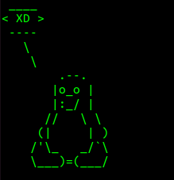

=====================
Guziki_ad
=====================

Guziki
------------------

Guziki

Guziki
~~~~~~~~~~~~~~~~~~

guziki

.. note::
   guziki

.. tip::
   guziki

Fragment kodu (liniowy)
~~~~~~~~~~~~~~~~~~~~~~

``public void main(String[] args){new Window3();}``

Fragment kodu (blokowy)
~~~~~~~~~~~~~~~~~~~~~~

.. code-block:: java

   public void main(String[] args){
      new Window3();
   }

Obraz z alternatywnym tekstem oraz podpisem
~~~~~~~~~~~~~~~~~~~~~~~~~~~~~~~~~~~~~~~~~~

Odnośnik zewnętrzny do innego serwisu
~~~~~~~~~~~~~~~~~~~~~~~~~~~~~~~~~~~~~

[RtD](https://ad-guziki.readthedocs.io/en/master/)

Listy numerowana, wypunktowana, definicji
~~~~~~~~~~~~~~~~~~~~~~~~~~~~~~~~~~~~~~~~~

1. Button1
2. Button2

- Button1
- Button2

: Button1
  guzik pierwszy

: Button2
  guzik drugi

